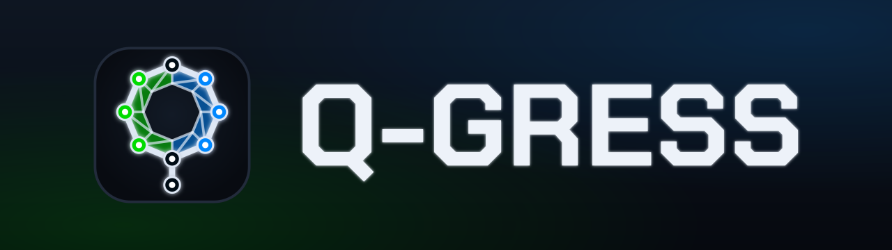

<p align="center">
  <a href="https://tok.github.io/Q-gress/"></a>
</p>

# Q-Gress

[](https://github.com/Tok/Q-gress/actions/workflows/ci.yml)
[](#desktop-only)
[](https://kotlinlang.org/docs/js-overview.html)

A browser-based **simulacrum of the mobile game *Ingress*** (modelled on its **~2018-era** mechanics —
resonators, links, fields, XM, bursters, mods), rebuilt in **3D**. Two factions — **ENL** ("frogs",
green) and **RES** ("smurfs", blue) — capture portals, link them, and create control fields over a
**real-world map**. It's a *simulacrum, not a playable map game*: each faction's behaviour is a set of
**sliders**, and an **AI driver's output _is_ those sliders** — so you pick each side's brain and watch
**AI vs AI** play itself out (or drive a side by hand). **No real Ingress/portal data is used** —
everything is generated. (Modern additions like drones / Machina are out of scope for now.)

<p align="center">
  <a href="https://tok.github.io/Q-gress/"></a>
</p>

The longer-term direction (the project is named for **Q-learning**) is in [`PLAN.md`](PLAN.md).

## Desktop only

This is **desktop-only by design** — it needs WebGL pixel readback, heavy three.js rendering, and
(eventually) in-browser WebGPU inference. Touch-only / mobile devices are detected and shown a notice
instead. Use **Chrome / Brave / Edge** on a desktop with a mouse.

## Highlights

- **3D world** rendered with **three.js** as a **MapLibre** custom layer over a real map (satellite +
  3D buildings); the simulation itself stays 2D.
- An **abstract-glass** look: portals are metal-pole + glass-orb vessels with resonator rods, links
  are glass pipes, control fields are plasma sheets — grayscale vessels, faction colour as the only
  tint. Physics **shatter**, volumetric **XMP** fireballs, **hack** centrifuge animations.
- Real **portal names** from map POI/street data; per-terrain movement; **3D positional audio**.
- A DOM HUD: a live MU "covered area" scoreboard, a per-metric **history dashboard**, an action log.
- **AI drivers (proof-of-concept).** Each faction's sliders can be driven by a **custom neural net**
  (a configurable MLP — default **16×16, two hidden layers** — trained headless by **neuroevolution**,
  with a baked champion shipped), an **adaptive heuristic**, or an **experimental in-browser LLM**
  (WebLLM / WebGPU). Pick each side's brain from the toolbar; the **NET** tab shows a live **activation
  diagram + genome heatmap** so you can watch the net think. Headless match harness, deterministic
  training, JSON genome save/load — see [`PLAN.md`](PLAN.md) Phase 6.
- **Play any location** (geocoded) and **shareable links** that reproduce a world from
  `lng/lat/size/seed` (the RNG is seedable).

See the shatter / XMP / hack effects in isolation in the
**[effects sandbox](https://tok.github.io/Q-gress/#demo)** (`/#demo`).

## Build, test & run

Requires **JDK 21** on `JAVA_HOME` (the build runs on 21 because detekt can't run on 25; the product
ships JS only). The app needs a desktop browser with WebGL.

```bash
./gradlew installGitHooks            # one-time: enable the pre-commit quality gate
./start.sh                           # build + serve + open the app in your browser
./gradlew jsBrowserDevelopmentRun    # alternatively: the webpack dev server
./gradlew jsNodeTest                 # run the unit tests in Node (fast, headless)
./gradlew ktlintCheck detekt         # formatting + lint + complexity gate
./gradlew jsBrowserDistribution      # production bundle → build/dist/js/productionExecutable
```

## CI / quality

Every push and PR runs a GitHub Actions pipeline ([`.github/workflows/ci.yml`](.github/workflows/ci.yml)):
**JDK 21 → ktlintCheck + detekt (complexity limits) + jsNodeTest**, and on the main branch it builds
the production bundle and **deploys it to GitHub Pages**. A local **pre-commit hook** (`.githooks/`,
installed via `installGitHooks`) runs the same gate so commits land green.

Coverage uploads to **Codecov**. Caveat: Kover has no Kotlin/JS support yet, so real line-coverage
arrives with the functional-core split (a `commonMain` + `jvm()` test target) — see `PLAN.md`. Until
then the badge just reflects the test job.

## Project docs

- [`PLAN.md`](PLAN.md) — roadmap / what's next (incl. the Phase 6 AI plan).
- [`docs/ARCHITECTURE.md`](docs/ARCHITECTURE.md) — how the system fits together.
- [`docs/FEATURES.md`](docs/FEATURES.md) — what's shipped.
- [`docs/RELEASE.md`](docs/RELEASE.md) — the release / deployment plan.
- [`docs/NN.md`](docs/NN.md) · [`docs/LLM.md`](docs/LLM.md) — the two AI-driver tracks.
- [`CLAUDE.md`](CLAUDE.md) — how to work in this repo (conventions + standards).

## The original 2D version

The original ~2018 **2D** build (untouched for ~7 years; also preserved in GitHub's 2020 **Arctic Code
Vault**) lives on as **archived source** on the **`archive/q-gress-2D`** branch — it depends on
long-dead tooling and isn't rebuildable. The keyless 3D rewrite replaces it as the primary site; the
old 2D may optionally still be served at `/2D/`. Its inlined Mapbox token should be revoked — see
[`docs/RELEASE.md`](docs/RELEASE.md).

## Third-party / copyright

- *Ingress* and the concept of Ingress are © **Niantic, Inc.** Q-Gress scrapes **no** data from
  Ingress and there is no intention to use real portal data; all agents and portals are generated.
- Map tiles © OpenStreetMap / OpenMapTiles / OpenFreeMap and Esri / Maxar / Earthstar (see the in-app
  attribution).
- Fonts (self-hosted, **SIL Open Font License 1.1** — see `fonts/OFL.txt`): **Chakra Petch** (display /
  wordmark) and **Coda** (body / data).
